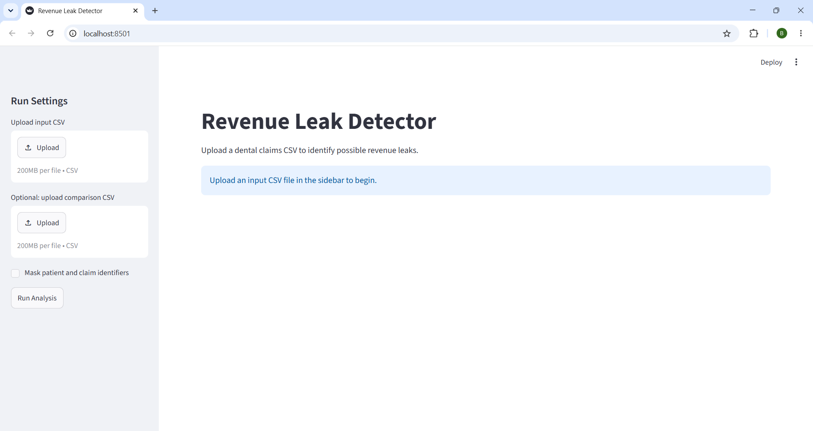
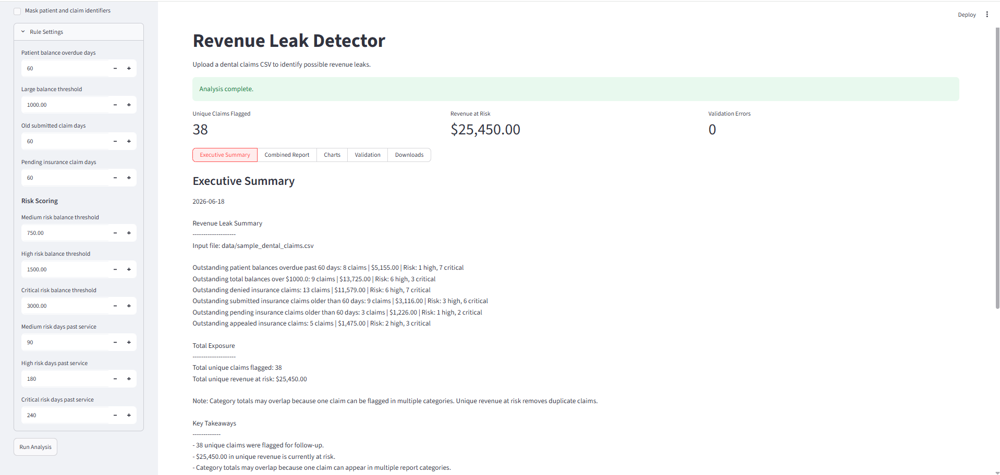
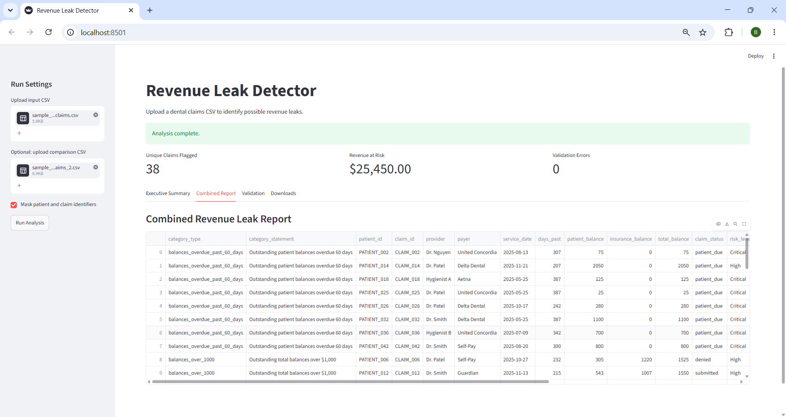
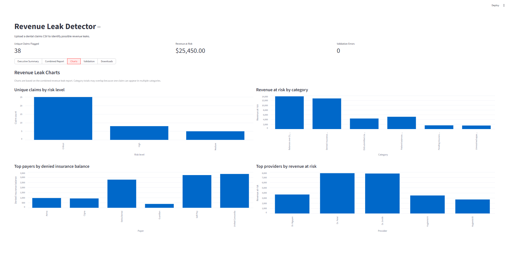

# Revenue Leak Detector

This is a Python project that reads synthetic dental claims data and identifies possible revenue leaks that may need follow-up.

The script analyzes sample patient and claim data, generates category-specific CSV reports, and prints a business-style summary to the terminal.

This repository includes AI-generated synthetic sample CSV files so the project can be tested without using real patient or claims data.

## Use Case

Revenue Leak Detector is designed to help identify dental claims and patient balances that may need follow-up. It analyzes CSV exports and creates prioritized reports for overdue balances, denied claims, pending insurance claims, appealed claims, and other possible revenue leaks.

## Technical Highlights

- Built a modular Python workflow for CSV validation, rule-based detection, report generation, and dashboard display
- Added automated tests for unit-level logic and full workflow behavior
- Used Streamlit to create a local dashboard for non-technical users
- Added identifier masking and synthetic-data boundaries to avoid unsafe healthcare-data assumptions

## Current Features

- Supports configurable run settings through `user_config/run_config.json`, with optional command-line overrides
- Reads patient and claim data from a CSV file
- Detects revenue leaks based on multiple reporting categories
- Scores flagged claims by risk level to help prioritize follow-up
- Includes recommended follow-up actions and priority reasons for each flagged claim to support workflow prioritization
- Identifies invalid rows and generates a validation error report for invalid CSV rows while continuing to generate reports with valid rows
- Generates and exports the detected results to separate CSV files for each revenue leak category and one CSV file for all combined revenue leaks
- Prints a terminal summary and saves an executive summary text file with:
  - Claim counts by category
  - Total unique claims flagged
  - Total unique revenue at risk
  - List of reports created
  - A comparison trend summary when run with the `--compare` command
  - A breakdown summary highlighting top payers, top providers, and top procedures
- Supports optional identifier masking mode to mask patient and claim identifiers in generated reports
- Supports flexible column mapping for alternate CSV header names
- Provides user-friendly error handling for missing files, missing columns, invalid dates, and invalid money values
- Includes automated testing for full workflow, data loading, revenue leak logic, recommended actions, trend comparison, breakdown summaries, identifier masking, and summary calculations
- Includes a local Streamlit dashboard with CSV upload, optional comparison upload, identifier masking toggle, summary metrics, report tabs, validation results, combined report preview, and downloadable outputs

## Local Dashboard

The project includes a local Streamlit dashboard.

The dashboard allows a user to:

- Upload an input dental claims CSV
- Optionally upload a comparison CSV for trend reporting
- Run the analysis using included sample data or uploaded CSV files
- Enable identifier masking mode with a checkbox
- Adjust rule thresholds for overdue balances, large balances, aging claims, and risk scoring before running the analysis
- View summary metric cards
- View the executive summary
- Preview the combined revenue leak report
- Review validation warnings
- Download all generated reports
- Filter the combined report by risk level, claim status, category, payer, provider, balance range, and search text
- View dashboard charts for risk levels, revenue leak categories, payers, and providers

The dashboard runs locally and does not upload data to a cloud service.

To start the dashboard:

```bash
python -m streamlit run app.py
```

Then upload a CSV file through the browser interface.

## Dashboard Preview

### Upload screen



### Executive summary, configurable rules, and metrics



### Combined report preview



### Dashboard charts



## Flexible Column Mapping

The script can recognize multiple possible header names for required CSV fields. For example, the service date column can be named `service_date`, `last_service_date`, `date_of_service`, or `DOS`.

This makes the tool more flexible for CSV files that use different naming conventions.

## Trend Comparison Summary

When run in comparison mode, the tool compares two CSV files and summarizes changes in flagged claims and revenue risk exposure.

There will be a trend comparison summary added to the executive summary along with the total summary of the input file.

The trend comparison summary compares the input file against another CSV file and shows new flagged claims, resolved claims, revenue risk increases, revenue risk decreases, and net change in revenue risk exposure.

## Breakdown Summary

The breakdown summary is printed on the executive summary to highlight top payers, providers, and procedures.

Currently, the breakdown summary shows the top payer by denied insurance balance, top provider by total revenue at risk, and the top procedure type by total revenue at risk.

The breakdown summary is a useful tool for providing management insight and answering business questions.

## Validation Report

If the input CSV contains invalid rows, the script creates a `validation_errors.csv` file in the `output/` folder.

The validation report includes the row number, field name, invalid value, and error message. Invalid rows are skipped, and revenue reports are generated using the valid rows only.

Examples of validation issues include invalid date values, invalid money values, and missing required row values.

## Identifier Masking Mode

The tool includes an optional identifier masking mode that replaces patient IDs and claim IDs with generic labels in generated reports.

This feature is intended for demo and portfolio use only. It should not be interpreted as HIPAA de-identification. HIPAA de-identification involves specific methods such as Safe Harbor or Expert Determination, and this project does not claim to perform or certify either method.

This project is intended for synthetic, sample, or already-masked data.

## Revenue Leak Categories

- Patient balances overdue 60 days
- Total balances over $1,000
- Denied/rejected insurance claims
- Old submitted insurance claims
- Pending insurance claims
- Unresolved appealed claims

## Risk Scoring

Flagged claims are assigned a risk level to help prioritize follow-up. Risk levels are included in the category-specific reports, the combined revenue leak report, the terminal summary, and the executive summary.

Risk levels currently include:

- Low
- Medium
- High
- Critical
  
## Project Structure

```text
revenue_leak_project/
  data/
    sample_dental_claims.csv
    sample_dental_claims_2.csv
  docs/
    images/
        combined_report_preview.png
        dashboard_charts.png
        dashboard_executive_summary.png
        dashboard_upload.png
        downloads_tabs.png
    example_executive_summary.md
  output/
    generated report files
  src/
    action_recommendations.py
    breakdowns.py
    config.py
    data_loader.py
    deidentification.py
    leak_categories.py
    main.py
    path_utils.py
    report_writer.py
    rules.py
    summary.py
    trend_comparison.py
    workflow.py
  tests/
    test_action_recommendations.py
    test_breakdowns.py
    test_data_loader.py
    test_deidentification.py
    test_full_workflow.py
    test_leak_categories.py
    test_path_utils.py
    test_summary.py
    test_trend_comparison.py
    test_workflow.py
  user_config/
    rules.json
    run_config.json
  app.py
  pytest.ini
  README.md
  requirements.txt
```

## How to Run

To run with default settings in `user_config/run_config.json`:

```bash
python src/main.py
```

To run with a specific CSV file:

```bash
python src/main.py --input data/csv_file_name.csv 
```

To generate a trend comparison summary:

```bash
python src/main.py --input data/csv_file_name.csv --compare data/other_csv_file_name.csv
```

To run with identifier masking mode:

```bash
python src/main.py --input data/csv_file_name.csv --deidentify
```

To run with a different configuration file:

```bash
python src/main.py --config user_config/run_config.json
```

- The script will print a business report summary to the terminal and create multiple category-specific CSV and text outputs in the `output/` folder.

To run the local dashboard:

```bash
python -m streamlit run app.py
```

## Run Configuration

The project includes a `user_config/run_config.json` file for default run settings.

Example:

```json
{
  "input_file": "data/sample_dental_claims.csv",
  "compare_file": null,
  "deidentify": false,
  "rules_file": "user_config/rules.json"
}
```

The `input_file` value controls which CSV file is analyzed by default. 

The `deidentify` value controls whether patient and claim identifiers are masked in generated reports.

The `compare_file` value can be used to provide a default comparison CSV for trend reporting.

Command-line arguments can override these defaults for a single run.

## Generated Outputs

The script creates several files in the `output/` folder:

- Category-specific CSV reports for each revenue leak type
- `combined_revenue_leak_report.csv`, which combines all flagged claims into one file
- `validation_errors.csv`, which lists invalid rows that were skipped
- `executive_summary.txt`, which saves the terminal summary in a business-readable text file
- `run_metadata.json`, which records run date, input file, validation counts, masking mode, and reports created

The local dashboard provides download buttons for all generated reports, including category-specific CSV reports, the combined report, validation report, executive summary, and run metadata file when available.

See [`docs/example_executive_summary.md`](docs/example_executive_summary.md) for an example executive summary.

## Dependencies

This project currently uses `pytest`, `pandas`, and `streamlit`.

Install project dependencies:

```bash
python -m pip install -r requirements.txt
```

## Running Tests

This project uses `pytest` for automated testing.

Run the test suite from the project folder:

```bash
python -m pytest
```

The tests currently check full workflow, CSV parsing, flexible column mapping, revenue leak category logic, summary calculations, identifier masking, recommended actions, trend comparison, and breakdown summaries.

## Input CSV Format

The input CSV should contain claim-level rows with the following required fields:

| Field | Description |
|---|---|
| patient_id | Unique patient identifier |
| claim_id | Unique claim identifier |
| service_date | Date of service in `YYYY-MM-DD` format |
| patient_balance | Amount owed by the patient |
| insurance_balance | Amount owed by insurance |
| total_balance | Total outstanding balance |
| claim_status | Current claim status |

### Optional Fields

The following fields are optional, but enable richer breakdown reporting:

| Field | Description |
|---|---|
| payer | Insurance payer name |
| provider | Rendering provider name |
| procedure_code_description | Procedure code or procedure description |
| location | Office or clinic location, if available |

## Supported Column Aliases

The script can recognize alternate header names, such as:

| Standard Field | Supported Examples |
|---|---|
| patient_id | `patient_id`, `Patient ID`, `patient_number`, `account_number` |
| claim_id | `claim_id`, `Claim ID`, `claim_number`, `encounter_id` |
| service_date | `service_date`, `last_service_date`, `date_of_service`, `DOS` |
| patient_balance | `patient_balance`, `Patient Balance`, `amount_due`, `patient_due` |
| insurance_balance | `insurance_balance`, `Insurance Balance`, `insurance_due` |
| total_balance | `total_balance`, `Total Balance`, `balance`, `outstanding_balance` |
| claim_status | `claim_status`, `Claim Status`, `status` |
| payer | `payer`, `payer_name`, `insurance_payer` |
| provider | `provider`, `provider_name`, `rendering_provider` |
| procedure_code_description | `procedure_code_description`, `procedure_code`, `procedure`, `procedure_description` |
| location | `location`, `office_location`, `clinic_location` |

## Privacy and Data Notice

This project is intended for synthetic, sample, or already-masked data only. Do not commit real patient data, claim exports, or other sensitive health information to Git.

Optional identifier masking mode masks patient and claim identifiers in generated reports for demo purposes. This should not be treated as a legal determination that real health data has been de-identified.

## Limitations

- The tool currently analyzes CSV files only.
- Date values are expected in `YYYY-MM-DD` format.
- Risk scoring rules are simple rule-based thresholds.
- This is a local prototype and does not connect directly to practice management systems.
- The tool does not claim HIPAA compliance.
- Revenue leak rules are simple configurable heuristics, not machine learning or billing-policy validation.
- Sample data is synthetic and does not represent real claim outcomes.

## Roadmap

Planned improvements:

- Add more detailed risk scoring rules
- Add dashboard charts and filtering for risk level, payer, provider, and procedure
- Improve validation reporting for more data quality issues
- Expand the local dashboard with charts, filters, and additional downloadable reports

## Sample Data Notice

The CSV files in the `data/` folder are AI-generated synthetic sample files created for demonstration and testing purposes.

They do not contain real patient information, real claim records, or real insurance data. This project should only be used with synthetic, sample, or properly masked data.

## Important Notes
- This project uses fake sample patient data for current testing. Real patient data should not be committed to Git.
- `user_config/run_config.json` should point to synthetic, sample, or masked data only.
- Files in the `output/` folder are generated and should not be committed to Git.
- Identifier masking mode masks patient and claim identifiers for demo purposes. It should not be treated as a legal determination that real health data has been de-identified.
- File paths are handled relative to the project folder, so the script does not depend on a specific user directory.
- If invalid rows are found, revenue reports are generated from valid rows only.

Copyright © 2026 Bailey White. All rights reserved.

This project is shared publicly as a portfolio and demonstration project. No license is currently granted for commercial reuse.